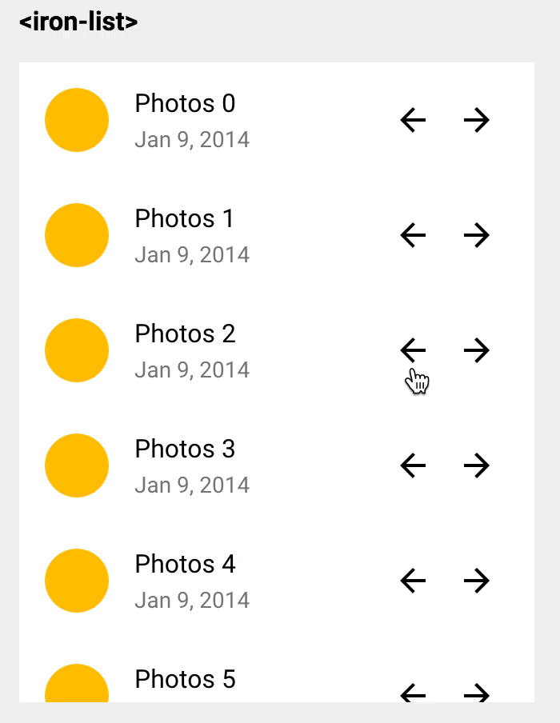

# swipe-action

_A Polymer element providing a declarative way to swipe DOM elements with configurable underlays and trigger some action when the swiping is done. Integrates seamlessly with the <iron-list> element._

## Use it in your project :

Element dependencies are managed via [Bower](http://bower.io/). To install this element,
use this command

    bower install --save https://github.com/OvermindDL1/swipe-action.git#190f18daa359bc7321c0c869239135f91ab2d547

## Documentation and demo

Please refer to the <a href="https://vguillou.github.io/webcomponents/swipe-action">component page</a> for more informations.

Demos available <a href="https://vguillou.github.io/webcomponents/swipe-action/demo">here</a>.

## License

[MIT License](https://github.com/vguillou/swipe-action/blob/master/LICENSE.md)

## Fork

This was forked and updated from:  https://github.com/vguillou/swipe-action

